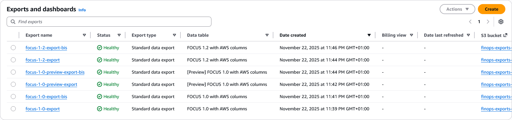

# Amazon Web Services (AWS) Billing export Terraform Module

Terraform module witch creates FinOps FOCUS billing export on AWS.

FOCUS v1.2 billing export for AWS now available!

This module will create a S3 bucket for AWS billing exports.



## What is FOCUS™?

The FinOps Cost and Usage Specification (FOCUS™) is an open-source specification that defines clear requirements for cloud vendors to produce consistent cost and usage datasets.

Supported by the FinOps Foundation, FOCUS™ aims to reduce complexity for FinOps Practitioners so they can drive data-driven decision-making and maximize the business value of cloud, while making their skills more transferable across clouds, tools, and organizations.

Learn more about FOCUS in [What is FOCUS?](https://focus.finops.org/what-is-focus/).

## Usage

```terraform
# FOCUS v1.2 AWS billing export with the creation of the S3 bucket
module "aws_billing_export" {
  source  = "IAmFrench/billing-export/aws"

  # Version of this module, see release on GitHub: https://github.com/IAmFrench/terraform-aws-billing-export/releases
  version = "1.0.5"
  
  # Name of the S3 bucket to create exports in
  s3_bucket_name   = "finops-exports-1a2b3c4d"
  # Type of the export
  export_type      = "FOCUS"
  # Version of the export
  export_version   = "1.2"
  # Name of the export
  export_name      = "focus-v1-2-export"
  # Prefix of the export
  export_s3_prefix = "focus/v1.2/1234556789"
}
```

```terraform
# FOCUS v1.2 AWS billing export with an existing S3 bucket
module "aws_billing_export" {
  source  = "IAmFrench/billing-export/aws"

  # Version of this module, see release on GitHub: https://github.com/IAmFrench/terraform-aws-billing-export/releases
  version = "1.0.5"
  
  # Name of the S3 bucket to create exports in
  s3_bucket_name   = data.aws_s3_bucket.export.id
  # Should this module create the S3 bucket with associated policy?
  create_s3_bucket = false
  # Type of the export
  export_type      = "FOCUS"
  # Version of the export
  export_version   = "1.2"
  # Name of the export
  export_name      = "focus-v1-2-export"
  # Prefix of the export
  export_s3_prefix = "focus/v1.2/1234556789"
}
```
## Roadmap

- [X] FOCUS `v1.2` export [Data Exports for FOCUS 1.2 is now generally available](https://aws.amazon.com/blogs/aws-cloud-financial-management/data-exports-for-focus-1-2-is-now-generally-available/)
- [X] FOCUS `v1.0` export [Data Exports for FOCUS 1.0 is now in general availability](https://aws.amazon.com/blogs/aws-cloud-financial-management/data-exports-for-focus-1-0-is-now-generally-available/) 
- [X] FOCUS `v1.0-preview` export [Announcing Data Exports for FOCUS 1.0 (Preview) in AWS Billing and Cost Management](https://aws.amazon.com/blogs/aws-cloud-financial-management/announcing-data-exports-for-focus-1-0-preview-in-aws-billing-and-cost-management/)

## Common errors

- `ValidationException: S3 bucket permission validation failed`: The existing S3 bucket is missing the policy to allow AWS export services to write to the bucket, see https://docs.aws.amazon.com/cur/latest/userguide/dataexports-s3-bucket.html
- `ServiceQuotaExceededException: Account has reached the resource limit of 2 on FOCUS_1_2_AWS table.`: You already have 2 FOCUS exports (version 1.2). You will need to delete at least one of the existing exports to create a new one. Billing and Cost Management > Cost and Usages Analysis > Data Exports.

## Backfill Request

AWS Data Export service doesn't support backfill when creating the export. Therefore you will need to open a support case.

Here is an support ticket sample to request a backfill:

```
Please backfill the data export for the following export:
export name: finops-focus-1-2-export
export id: arn:aws:bcm-data-exports:us-east-1:<aws-account-id>>:export/finops-focus-1-2-export-<random-uuid>

Desired start date: YYYY-MM-DD
```

## Minimum permissions

You can use the following IAM policy to allow a user to create and delete a FOCUS billing export using this Terraform module:

Note: This first policy assumes that you use a bucket name starting with `finops-exports-` (as demonstrated in the [example](./examples/) folder).

```json
{
	"Version": "2012-10-17",
	"Statement": [
		{
			"Sid": "Statement1",
			"Effect": "Allow",
			"Action": [
				"s3:CreateBucket",
				"s3:ListBucket",
				"s3:GetBucketPolicy",
				"s3:GetBucketAcl",
				"s3:GetBucketCORS",
				"s3:GetBucketWebsite",
				"s3:GetBucketVersioning",
				"s3:GetAccelerateConfiguration",
				"s3:GetBucketRequestPayment",
				"s3:GetBucketLogging",
				"s3:GetLifecycleConfiguration",
				"s3:GetReplicationConfiguration",
				"s3:GetEncryptionConfiguration",
				"s3:GetBucketObjectLockConfiguration",
				"s3:GetBucketTagging",
				"s3:DeleteBucket",
				"s3:PutBucketPolicy",
				"s3:DeleteBucketPolicy",
				"s3:ListBucketVersions",
				"s3:DeleteObjectVersion",
				"s3:DeleteObject"
			],
			"Resource": "arn:aws:s3:::finops-exports-*"
		}
	]
}
```

```json
{
	"Version": "2012-10-17",
	"Statement": [
		{
			"Sid": "Statement1",
			"Effect": "Allow",
			"Action": [
				"bcm-data-exports:CreateExport",
				"bcm-data-exports:GetExport",
				"bcm-data-exports:ListTagsForResource",
				"bcm-data-exports:DeleteExport"
			],
			"Resource": [
				"arn:aws:bcm-data-exports:us-east-1:*:export/*",
				"arn:aws:bcm-data-exports:us-east-1:*:table/FOCUS_*"
			]
		},
		{
			"Sid": "Statement2",
			"Effect": "Allow",
			"Action": [
				"cur:putReportDefinition"
			],
			"Resource": "arn:aws:cur:us-east-1:*:/putReportDefinition"
		}
	]
}
```

<!-- BEGIN_TF_DOCS -->
## Requirements

| Name | Version |
|------|---------|
| <a name="requirement_terraform"></a> [terraform](#requirement\_terraform) | ~> 1.1 |
| <a name="requirement_aws"></a> [aws](#requirement\_aws) | ~> 6.0 |

## Providers

| Name | Version |
|------|---------|
| <a name="provider_aws"></a> [aws](#provider\_aws) | ~> 6.0 |

## Modules

No modules.

## Resources

| Name | Type |
|------|------|
| [aws_bcmdataexports_export.focus](https://registry.terraform.io/providers/hashicorp/aws/latest/docs/resources/bcmdataexports_export) | resource |
| [aws_s3_bucket.export](https://registry.terraform.io/providers/hashicorp/aws/latest/docs/resources/s3_bucket) | resource |
| [aws_s3_bucket_policy.allow_data_export](https://registry.terraform.io/providers/hashicorp/aws/latest/docs/resources/s3_bucket_policy) | resource |
| [aws_caller_identity.current](https://registry.terraform.io/providers/hashicorp/aws/latest/docs/data-sources/caller_identity) | data source |
| [aws_iam_policy_document.allow_data_export](https://registry.terraform.io/providers/hashicorp/aws/latest/docs/data-sources/iam_policy_document) | data source |
| [aws_s3_bucket.export](https://registry.terraform.io/providers/hashicorp/aws/latest/docs/data-sources/s3_bucket) | data source |

## Inputs

| Name | Description | Type | Default | Required |
|------|-------------|------|---------|:--------:|
| <a name="input_create_s3_bucket"></a> [create\_s3\_bucket](#input\_create\_s3\_bucket) | Option to create or not the S3 bucket for the billing export.<br/>If set to `false`, this module will not create the S3 bucket.<br/>Therefore please check that bucket policies are sets to allow AWS export services to write files in it.<br/>More info: https://docs.aws.amazon.com/cur/latest/userguide/dataexports-s3-bucket.html<br/><br/>E.g.: `true`, `false` | `bool` | `true` | no |
| <a name="input_export_name"></a> [export\_name](#input\_export\_name) | Name of the billing export. <br/>Validation: Export name must be unique, not include spaces, and contain only alphanumeric and characters ! - \_ . * ' ( )<br/>E.g.: `focus-v1-2` | `string` | n/a | yes |
| <a name="input_export_s3_prefix"></a> [export\_s3\_prefix](#input\_export\_s3\_prefix) | Prefix of the billing export.<br/>E.g.: `focus/v1.2/123456789` with `123456789` being the account id | `string` | `""` | no |
| <a name="input_export_type"></a> [export\_type](#input\_export\_type) | Version of the billing export.<br/>Valid values: `FOCUS`<br/>E.g.: `FOCUS` | `string` | n/a | yes |
| <a name="input_export_version"></a> [export\_version](#input\_export\_version) | Version of the billing export. Should be use with `export_type`.<br/>Valid values are:<br/>- `1.2`, `1.0` and `1.0-preview` for FOCUS<br/>E.g.: `1.2`, `1.0`, `1.0-preview` | `string` | n/a | yes |
| <a name="input_s3_bucket_name"></a> [s3\_bucket\_name](#input\_s3\_bucket\_name) | Name of the S3 bucket to be created<br/>E.g.: `finops-focus-export-a1b2c3d4` | `string` | n/a | yes |
| <a name="input_s3_force_destroy"></a> [s3\_force\_destroy](#input\_s3\_force\_destroy) | Force the destruction of the S3 bucket containing the billing export when the <br/>module is destroyed even if it contains objects.<br/><br/>E.g.: `true`, `false`<br/><br/>Default is `false`. | `bool` | `false` | no |
| <a name="input_tags"></a> [tags](#input\_tags) | Tags to apply to all created resources.<br/><br/>E.g.:<pre>{<br/>  createdBy = "Terraform"<br/>}</pre> | `map(string)` | `{}` | no |

## Outputs

| Name | Description |
|------|-------------|
| <a name="output_export_arn"></a> [export\_arn](#output\_export\_arn) | ARN of the export |
| <a name="output_s3_arn"></a> [s3\_arn](#output\_s3\_arn) | ARN of the export bucket |
<!-- END_TF_DOCS -->
