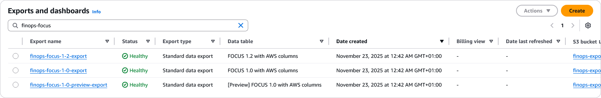

# FOCUS v1.2 billing export with S3 bucket

This example will create all available AWS FOCUS billing export and the corresponding S3 bucket.

Please note that only 2 exports of the same type (eg. FOCUS v1.2) can be created at the same time. This is an AWS limitation.

<!-- BEGIN_TF_DOCS -->
## Requirements

| Name | Version |
|------|---------|
|  [terraform](#requirement\_terraform) | ~> 1.1 |
|  [aws](#requirement\_aws) | ~> 6.0 |

## Providers

No providers.

## Modules

| Name | Source | Version |
|------|--------|---------|
|  [aws\_billing\_export](#module\_aws\_billing\_export) | ../../ | n/a |

## Resources

No resources.

## Inputs

No inputs.

## Outputs

No outputs.
<!-- END_TF_DOCS -->
